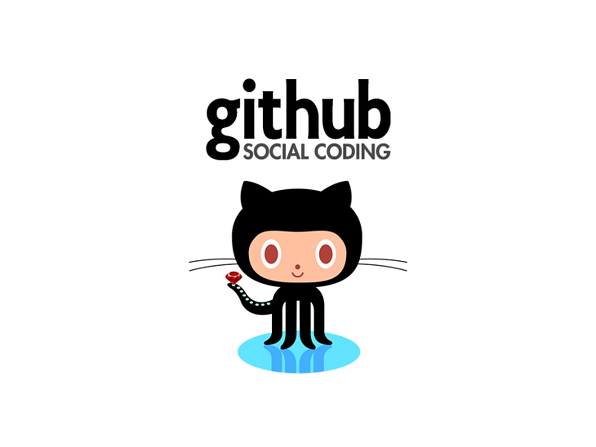
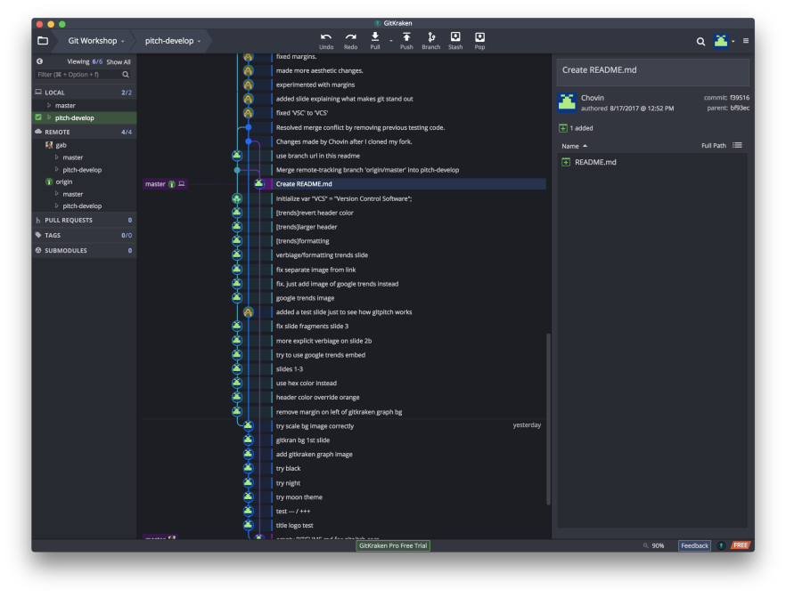
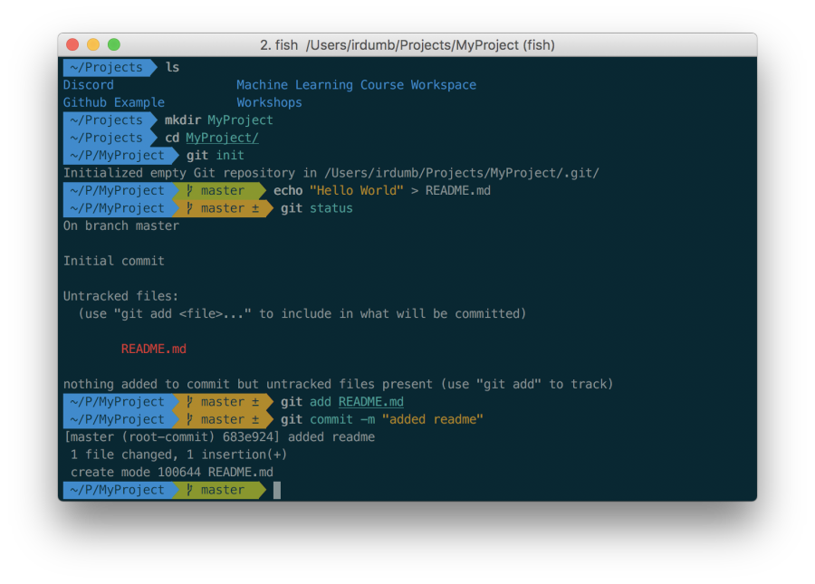
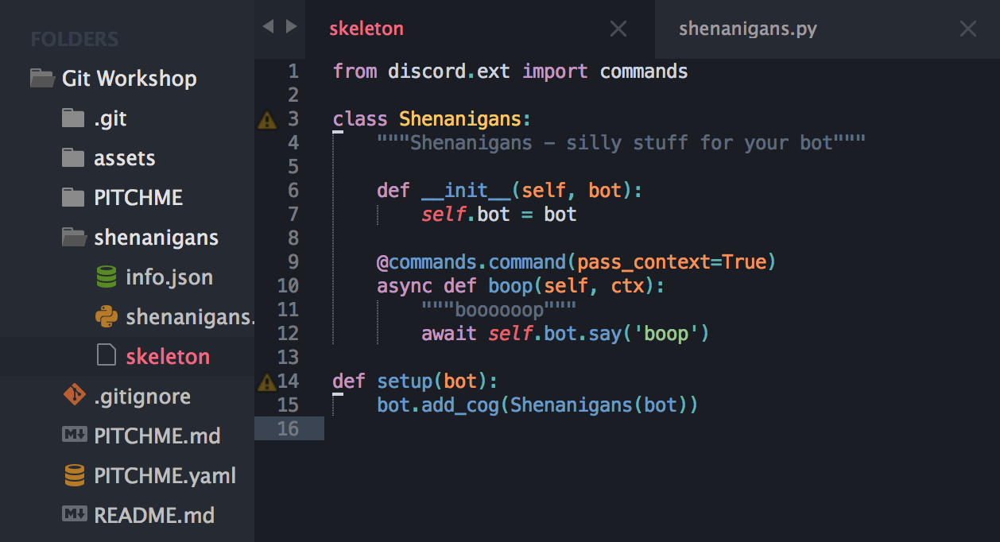

---
 
### Before our journey, you might want to get these stuffs


---

### Have you ever wanted to..
- Revert a change after making a mistake?  |
- Know what a person changed, where and when?  |
- See differences in versions of a file?  |
- Go explore a new idea but still be able to go back?  |
- Not lose your work when someone overwrites?  |
- Restore from a backup 15 minutes ago?  |

+++

### What about..
- Collaborate on a single document seamlessly while offline?  |
- Needed to maintain multiple versions?  |
- Prove that a change broke or fixed some code?  |
- Know what decisions led to the introduction of a feature?  |
- Isolate the staged changes to be moved into your production server?  |


---?image=assets/gitkraken-graph.png&size=100% auto

<h3 style="text-align:left;margin-left:55%">What is Git?</h3>
<p style="text-align:left;color:grey;margin-left:55%;font-size:.7em">Version Control Software (VCS)<p>
<ul style="text-align:left;margin-left:48%">
    <li>What changed</li>  <!-- .element: class="fragment" -->
    <li>When it changed</li>  <!-- .element: class="fragment" -->
    <li>Who changed it</li>  <!-- .element: class="fragment" -->
</ul>

---

### What about other VCS?

Other VCS may work <em2>better</em2> for..
- binary files
- large repositories
- images

+++

<h3 style="color:white"><em2>Git</em2> is best for text files (<em2>code</em2>)</h3>

and by far the [most used](https://trends.google.com/trends/explore?date=all&q=%2Fm%2F05vqwg,%2Fm%2F012ct9,%2Fm%2F08441_,%2Fm%2F08w6d6,%2Fm%2F09d6g&hl=en-US) VCS overall  


+++

### Simply because....
<ul>
    <li>It's <em2>Distributed.</em2></li>  <!-- .element: class="fragment" -->
    <li>It's Fast</li>  <!-- .element: class="fragment" -->
    <li>Powerful <em2>staging environments</em2></li>  <!-- .element: class="fragment" -->
    <li>Powerful <em2>branching</em2></li>  <!-- .element: class="fragment" -->
    <li>Lets the developer work how he wants to</li>  <!-- .element: class="fragment" -->
</ul>

Note:
With Git each person that works on a project has their own copy of the whole history of the project
(natural backup mechanism, offline, work on same document at the same time, most operations are done offline)

Because of that, it's fast. very fast in terms of VCS. Git also only tracks the changes that happen to files instead of whole copies of files

When do you share a word doc with someone? usually when you're at a good stopping point right? Let's say I'm working on a new version of code or an essay, or whatever. typically, start.. idea.. grammar error.. or dangit this guy misspelled this company's name throughout the whole document! 
soon I have this just lump of 5 unfinished branches of work and ideas and I have to finish them all before I can send the document to someone.
Git's staging environment lets break up all those ideas after we decide it's time to touch base. and we can push ONLY the changes we decide are finish over to the rest of the team and continue working on our other ideas locally.

That's another thing Git does well. Git allows you to branch off and go play around with a new idea or feature seamlessly. This also allows for powerful collaboration without stepping on other developers' toes, and we'll get into more of that later.

git doesn't get in the way of a developer's prefered workflow. git is just a set of tools, you can use whatever workflow you want and it'll do its job. You can customize it to your liking, specifying your own workflow, adding hooks to lets say redeploy your website whenever a commit it pushed to the master branch


---

##  Github
  
The <em2>home</em2> for Open Source

+++

### Open Community

- The largest open source community  |
<li>[Trusted](https://github.com/chrislgarry/Apollo-11)</li>  <!-- .element: class="fragment" -->
- Welcoming  |  

Note: 
64+ million open source projects, 23+ million users

Google, Adobe, Twitter, Paypal, AWS, Yahoo, LinkedIn, Facebook, Dropbox, Mozilla (everything they do is on github: https://github.com/mozilla/bedrock/), NASA (kepler: https://github.com/nasa/kepler-pipeline)

They recognize that project activity is mostly voluntary. They recognize that they need to provide an easy learning environment. and they recognize that creating something together is fun and inspiring.  

---

### General Usage

```
$ mkdir MyProject
$ cd MyProject
$ git init
Initialized empty Git repository in /Users/irdumb/Projects/MyProject/.git/
$ echo "Hello World" > README.md
$ git add README.md
$ git commit -m "added readme"
[master (root-commit) 5ca20d4] added readme
 1 file changed, 1 insertion(+)
 create mode 100644 README.md
$ echo "o/-<|:" > README.md
$ git diff HEAD
diff --git a/README.md b/README.md
index 557db03..ff46535 100644
--- a/README.md
+++ b/README.md
@@ -1 +1 @@
-Hello World
+o/-<|:
$ cat README.md
o/-<|:
$ git add README.md
$ git commit -m "added skateboard dude to readme"
[master 492d605] added skateboard dude to readme
 1 file changed, 1 insertion(+), 1 deletion(-)
$
```
@[0](Let's break it down.)
@[1-2](Make or go into an existing project)
@[3-4](Set up your git repo. This creates an invisible <em2>.git</em2> folder in the project folder)
@[5](add some stuff to the project)
@[6](stage the changes)
@[7](commit the staged changes with a <em2>-m</em2>essage)
@[8-10](we now have our first git commit!<br>It has 1 file change and 1 insertion.)
@[11](let's add some more stuff!)
@[12](let's look at the <em2>diff</em2>erences between the project as it is now and what we had previously committed)
@[13-19](we see that..)
@[15-16](the only thing that changed in our project was README.md)
@[17](and that only 1 line changed: 1 line removed, 1 line added )
@[18-19](and that change was the skateboard dude replacing <em2>Hello World</em2>)
@[20-21](double-checking the file, we see that that is the case.)
@[22-25](now we add it and commit it like before!)

+++
## Now it's your turn!
- go to / make a project
- git <em2>init</em2>
- make a change
- git <em2>status</em2> <dem># to see the status of the staging env</dem>
- git <em2>add</em2> path
- git <em2>commit</em2> -m "message"
<li>git <em2>log</em2> <dem style="font-size: .7em">--graph --abbrev-commit --decorate --format=format:'%C(bold blue)%h%C(reset) - %C(bold cyan)%aD%C(reset) %C(bold green)(%ar)%C(reset)%C(auto)%d%C(reset)%n''          %C(white)%s%C(reset) %C(dim white)- %an%C(reset)'  --all</dem> <!-- .element: class="fragment" --> </li> <!-- .element: class="fragment" -->

---
### Sublime Text 3
<p style="text-align:center;color:grey; font-size:.7em">The Text Editor </p>


+++

### GitKraken
<p style="text-align:center;color:grey; font-size:.7em">The Visualizer </p>



+++

### Git
<p style="text-align:center;color:grey; font-size:.7em">The Version Control </p>



---

## Let's Collaborate!

```
git clone https://github.com/FreeCodeCampGuam/Git-Workshop
```
- Open it in sublime  |

  <!-- .element: class="fragment" -->

+++?code=shenanigans/skeleton&lang=python
@[0](This is a skeleton cog for a Red-DiscordBot <bot>@fccgpotato</bot> in <dmention>#testing</dmention>)
@[1](We're using the <em2>discord.py</em2> api wrapper)
@[3-7](Our cog will be named <em2>Shenanigans</em2>. This a how you make a class in <em2>Python</em2>.)
@[14-15](The Red bot will call the <em2>setup</em2> function to load the cog. It gives the bot an instance of our <em2>Shenanigans</em2> class)
@[9-12](This is a simple command that makes the bot say <dem>boop</dem> when we type <dem>pboop</dem> in <dmention>#testing</dmention>
@[9](This makes the following function a command for the bot)
@[10](<em2>boop</em2> is the name of our command)
@[11](This is the desciption that gets displayed when you type <dem>phelp boop</dem>)
@[12](Here we tell the bot to say <dem>boop</dem>)


+++?code=shenanigans/shenanigans.py&lang=python

@[0](https://i.imgur.com/PLwj35n.jpg)
